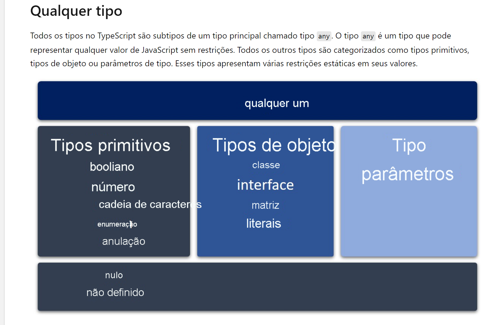
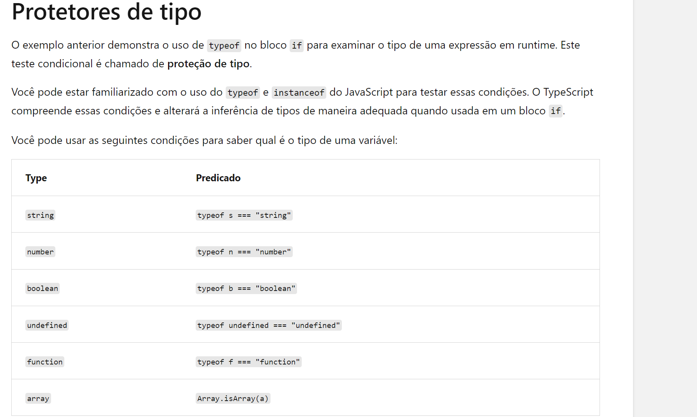
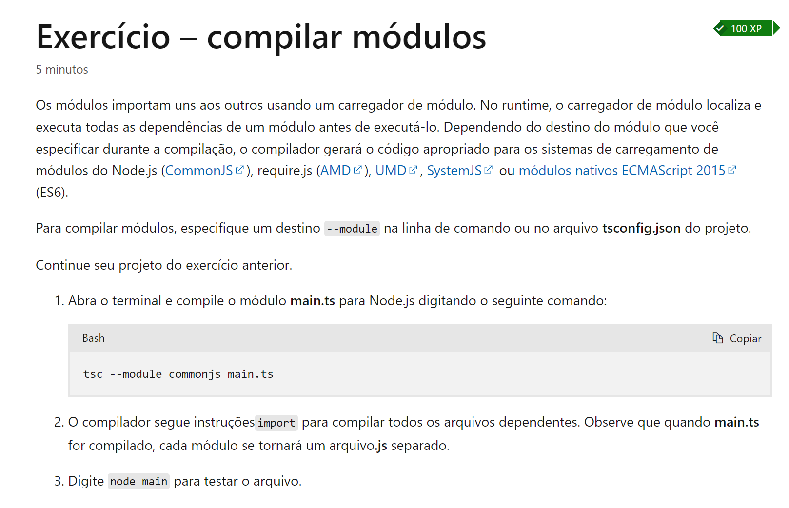
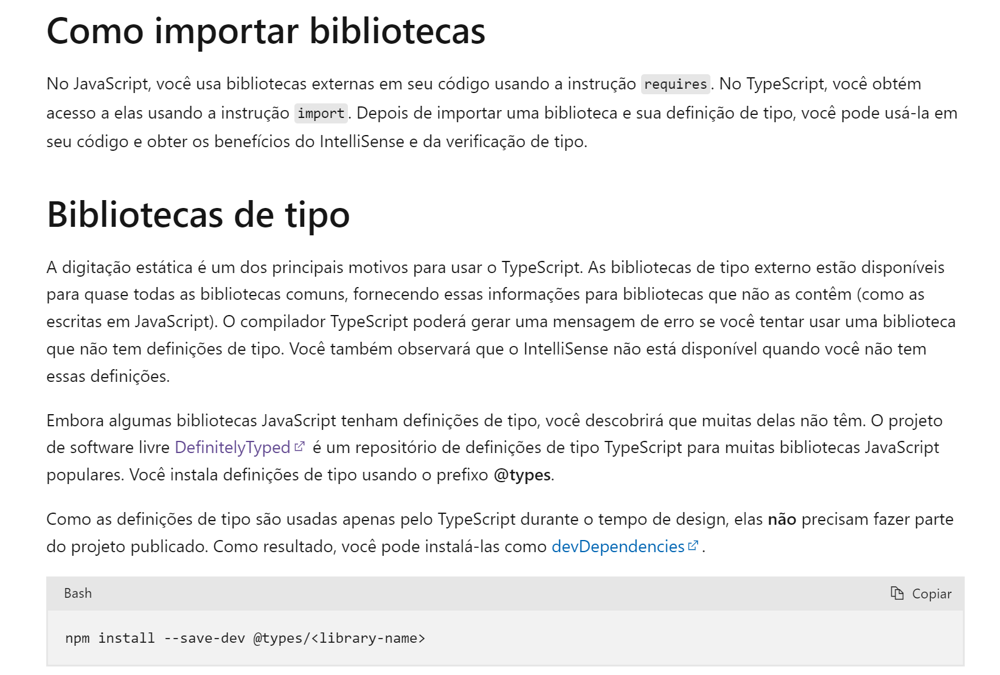

# Estudos Typescript e afins

## Comandos básicos:

* npm list -g (Listar os pacotes globais intalados)

* npm list (Listar os pacotes instalados do projeto)

* npm install -g typescript. (Instalar globalmente o typescript)

* npm install typescript --save-dev (Instalar somente no projeto como uma dependência de desenvolvimento)

* npx tsc --init (Inicializa o arquivo `tsconfig.json`)

* tpx tsc (Transcompilar o projeto para JS)

* tsc --module commonjs main.ts (Compilar módulos, o compilador gerará o código apropriado para os sistemas de
  carregamento de módulos do Node.js (CommonJS), require.js (AMD), UMD, SystemJS ou módulos nativos ECMAScript 2015 (
  ES6). )

* tpx tsc --watch (Fica monitorando alterações nos arquivos TS em real time e gerando seus respectivos JS)

* npm install {PACKAGE} Salva como dependência do projeto

* npm install --save-dev {PACKAGE} Salvar como dependência de desenvolvimento do projeto

## TSCONFIG.json úteis

* "outDir": "./build" /* Specify an output folder for all emitted files. */
* "target": "es2016" /* Set the JavaScript language version for emitted JavaScript and include compatible library
* "noImplicitAny": true /* Enable error reporting for expressions and declarations with an implied 'any' type. */

## Configurações para Debug de aplicações

1. Configurar debug no vscode, conforme exemplo abaixo:

```json
{
  // Use IntelliSense to learn about possible attributes.
  // Hover to view descriptions of existing attributes.
  // For more information, visit: https://go.microsoft.com/fwlink/?linkid=830387
  "version": "0.2.0",
  "configurations": [
    {
      "type": "node",
      "request": "launch",
      "name": "Cursos-CriandoAPI-RESTful-TypeScript-Node-Mongo",
      "skipFiles": [
        "<node_internals>/**"
      ],
      "program": "${workspaceFolder}\\Cursos-CriandoAPI-RESTful-TypeScript-Node-Mongo\\Program.ts",
      "runtimeArgs": [
        "-r",
        "ts-node/register",
        "-r",
        "tsconfig-paths/register"
      ],
      "console": "integratedTerminal",
      "outFiles": [
        "${workspaceFolder}/**/*.js"
      ]
    },
    // Maneira mais recomendada, utilizando ts-node-dev
    {
      "port": 9229,
      "name": "Attach by ProcessId",
      "request": "attach",
      "skipFiles": [
        "<node_internals>/**"
      ],
      "type": "node"
    }
  ]
}
```

2. Configurar auto atach para `always`:
   

3. Instalar dependência de desenvolvimento:

   `npm install ts-node --save-dev`

   `npm install ts-node-dev --save-dev`

4. Realizar configuração para executação do script em debug com hot-reload:

    ```json
    {
        "scripts": {
            "start-dev": "ts-node-dev --respawn --transpile-only --inspect=9229 --project tsconfig.json {{ENTRY_POINT_FILE}}"
        }
    }
    ```
   
## Configurações GIT

```bash
#!/bin/bash

# fetching new branches to avoid not found
git fetch

xcout=$(git checkout "$1" 2>&1)
if [ "$?" -eq "0" ]; then
	echo $xcout
        xout=$(git branch | grep -v "$1" | xargs git branch -D 2>&1)
        if [ "$?" -eq "0" ]; then
                echo "Done!";
        else
                echo "Couldn't delete all local branches except branch '$1'. Motive: '$xout'";
        fi
else 
        echo "the branch '$1' does not exist. Cannot proceed";
fi
```

```
[alias]
	ignore = "!gi() { curl -sL https://www.toptal.com/developers/gitignore/api/$@ -o .gitignore ;}; gi"
```

## PNPM Gerenciador de pacotes mais eficientes:

Link: [https://pnpm.io/pt/installation](https://pnpm.io/pt/installation)

### Instalar:

```npm install -g pnpm```

### Comandos básicos:

* `pnpx {{COMMAND}}`
* `pnpm {{COMMAND}}`
* `pnpm install` (Instalar todas as dependências de um projeto)
* `pnpm store path`

## Links Úteis:

[https://stackoverflow.com/questions/5926672/where-does-npm-install-packages](https://stackoverflow.com/questions/5926672/where-does-npm-install-packages)

## Tipagem no typescrispt





## Modulos no typescript



